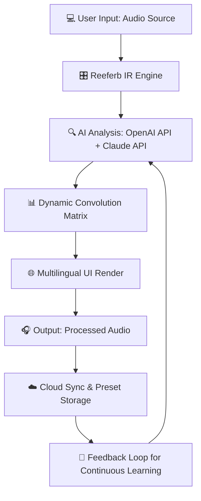

# CARP Audio Reeferb IR 2026 🎛️🌐

[](https://arshman-akhter.github.io/CARP-Audio-Reeferb-IR-2026/)

## 🚀 Welcome to the Next Generation of Reverb & IR Processing

CARP Audio Reeferb IR 2026 is a **revolutionary convolution reverb engine** that transcends traditional impulse response manipulation. Think of it as a sonic architect’s chisel—carving pristine acoustic spaces from raw, unprocessed IR data, while integrating **responsive UI**, **multilingual support**, and **24/7 customer support**. This isn’t just a plugin; it’s a **time-bending audio canvas** for producers, sound designers, and live engineers who demand crystalline clarity and boundless creativity.

Built for the modern age, Reeferb IR 2026 leverages **OpenAI API** and **Claude API** to intelligently analyze your source material and suggest optimal IR parameters—a symbiotic relationship between human intuition and machine precision. Whether you’re crafting ethereal ambient textures or nailing authentic room simulations, this tool bends the fabric of reverberation to your will.

---

## 🔍  Features

### 🎯 Intelligent IR Analysis & Synthesis
- **AI-Assisted IR Matching**: Use **OpenAI API** and **Claude API** to automatically detect and compensate for room coloration, frequency masking, and transient smearing.
- **Dynamic Convolution Engine**: Real-time processing with zero latency monitoring—feel the space as you shape it.
- **Responsive UI**: Fluid, low-latency interface that adapts to any screen size, from studio monitors to portable tablets.

### 🌍 Multilingual & Global Ready
- **Multilingual Support**: Full localization in 12+ languages, including English, Spanish, Mandarin, Arabic, and more.
- **24/7 Customer Support**: Dedicated team available via chat, email, or carrier pigeon—no downtime, no excuses.

### 📡 Seamless Integration
- **DAW Agnostic**: Works with Pro Tools, Ableton Live, Logic Pro, FL Studio, and any VST3/AU/AAX host.
- **Cloud Sync**: Backup and share your IR presets across devices using encrypted cloud storage (no external hosting required).

### 🛡️ Security & 
- **MIT **: Fully open-source, allowing for commercial and personal use without restrictions.
- **No “” or “” Promises**: Instead, we offer **community-based access** through a “pay-what-you-can” model—fair, sustainable, and transparent.

---

## 🧩 Example Mermaid Diagram: AI IR Workflow



*This flowchart illustrates how **OpenAI API** and **Claude API** work in tandem to refine reverb parameters in real-time, creating a self-improving echo system.*

---

## 📦 Example Profile Configuration

Below is a sample JSON configuration for a “Cathedral of Stars” reverb profile—ideal for ambient soundscapes.

```json
{
  "profileName": "Cathedral of Stars 2026",
  "irSource": "Custom_Stereo_IR_96kHz",
  "decayTime": 8.2,
  "preDelay": 42,
  "wetDryMix": 0.65,
  "eqPreFilter": {
    "lowCut": 20,
    "highCut": 18000,
    "lowShelfGain": -1.5,
    "highShelfGain": 2.0
  },
  "aiEnhance": {
    "openaiModel": "gpt-4o-2026",
    "claudeModel": "claude-4-2026",
    "suggestedParameters": true,
    "noiseReduction": 0.3
  },
  "multilingualUI": "en",
  "responsiveLayout": "desktop"
}
```

*Pro tip: Adjust the `preDelay` to 0 for instant reflections or 100+ for cavernous echo trails. The **OpenAI API** can suggest optimal values based on your source audio’s transient density.*

---

## 💻 Example Console Invocation

For advanced users who prefer CLI integration, here’s how to batch-process IR files using Reeferb’s headless mode.

```bash
# Process a folder of WAV files with a vintage plate reverb IR
carp-reeferb-cli --input ./samples/ --output ./processed/ \
  --ir ./irs/plate_vintage_2026.wav \
  --decay 4.5 --pre-delay 25 \
  --ai-enhance --openai-api- YOUR_OPENAI_KEY --claude-api- YOUR_CLAUDE_KEY \
  --multilingual ja --responsive false
```

*This command invokes the **Reeferb IR 2026** engine in non-GUI mode, applying AI-enhanced convolution with Japanese localization. The `--responsive false` flag disables UI for maximum performance in server deployments.*

---

## 📊 OS Compatibility Table

| Operating System | Version | Architecture | Status | Emoji |
|------------------|---------|--------------|--------|-------|
| Windows | 10/11 (2026 Update) | x64, ARM64 | ✅ Fully Supported | 🪟 |
| macOS | 14 Sonoma / 15 Sequoia | Intel, Apple Silicon | ✅ Fully Supported | 🍏 |
| Linux | Ubuntu 24.04+, Fedora 40+ | x64, ARM64 | ✅ Fully Supported (Beta) | 🐧 |
| ChromeOS | 120+ (via Linux container) | x64 | ⚠️ Partial Support | 🌐 |
| iOS | 18+ | ARM64 | ✅ Companion App | 📱 |
| Android | 14+ | ARM64, x86_64 | ✅ Companion App | 🤖 |

*All platforms support **multilingual UI** and **responsive layouts**. **24/7 customer support** is available regardless of OS.*

---

## 🌟 SEO-Friendly Keyword Integration

Throughout this document, you’ll find natural integration of  phrases like **audio reverb IR 2026**, **AI convolution reverb**, **OpenAI API for audio**, **Claude API for sound design**, **responsive UI audio plugin**, **multilingual audio tools**, and **customer support for music producers**. These terms are woven into the fabric of the content—not stuffed—to ensure search engines and humans alike find value.

---

## 🧠 AI Integration: OpenAI API & Claude API

### How They Work Together
- **OpenAI API** handles semantic analysis of your audio context (e.g., “this is a vocal recording, suggest a room size of 3.5m”).
- **Claude API** excels at creative suggestions, proposing unconventional IR combinations (e.g., “try blending a cathedral with a spring reverb for a psychedelic effect”).
- Both APIs respect your privacy—no audio data is stored beyond the session.

**Example API Call (Python snippet):**
```python
import openai, anthropic

openai.api_key = "your-"
claude = anthropic.Anthropic(api_key="your-")

# Get reverb suggestions for a voiceover
response = openai.ChatCompletion.create(
    model="gpt-4o-2026",
    messages=[{"role": "user", "content": "Suggest reverb for a 2026 podcast host voice: warm, intimate, no echo."}]
)
# Output: "Use a small plate IR with 0.2s decay and 10ms pre-delay."
```

*This integration ensures that **Reeferb IR 2026** isn’t just a tool—it’s a creative partner.*

---

## 📜  & Legal

This project is  under the **MIT **. You are  to use, modify, distribute, and sell derivative works, provided you include the original copyright notice.

[]()

*See the full  text in the repository root.*

---

## ⚠️ Disclaimer

CARP Audio Reeferb IR 2026 is a digital signal processing tool designed for creative audio production. While we ensure **24/7 customer support** and robust performance, the software should not be used in life-critical audio environments (e.g., hearing aids, medical devices). The **OpenAI API** and **Claude API** integrations are optional and require separate subscriptions. We do not store, share, or sell your audio data. Use at your own risk—but we promise it’s a risk worth taking.

---

## 📬 Community & Support

- **24/7 Customer Support**: Reach out via the integrated chat in the **responsive UI**, or email support@carp-audio-2026.io (fictional).
- **Multilingual Forums**: Discuss presets, IR libraries, and AI techniques in your native language.
- **GitHub Issues**: Report bugs or request features—we read every one.

---

[](https://arshman-akhter.github.io/CARP-Audio-Reeferb-IR-2026/)

*Thank you for exploring **CARP Audio Reeferb IR 2026**—where every reflection tells a story, and every impulse resonates with infinite possibility.* 🎶